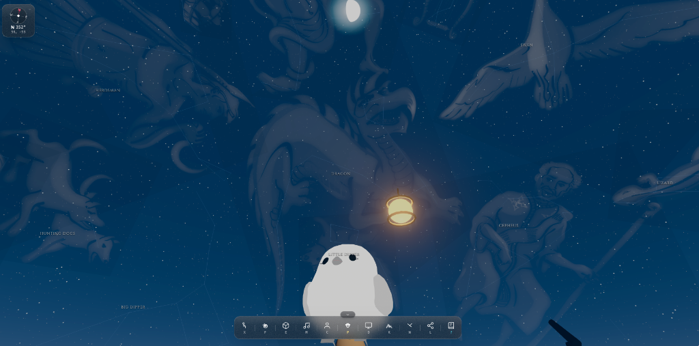

# Chill - 3D Ambient World & Interactive Haven

**Live**: [chill.plaloma.com](https://chill.plaloma.com)

Chill is a web-based, real-time 3D ambient haven built with Three.js (WebGPU/WebGL), Next.js, Web Audio API, and local on-device AI. It provides an immersive spatial experience featuring procedurally shaded landscapes, real astronomical celestial mapping, customizable humanoid avatars, companion pets, and physics-based mini-games.

> **Status**: Chill is under active development. Current priority is delivering the best possible **solo experience** — world exploration, avatar and pet customization, and stargazing. Multiplayer is implemented at the protocol level but is not yet enabled for players; see the [Roadmap](docs/roadmap.md) for what's shipping next.

<p align="center">
  
</p>

---

## Key Highlights

- **WebGPU / WebGL 3D Engine**: Built on Three.js with Three Shading Language (TSL) procedural shaders, clipmap terrain rendering, dynamic time-of-day atmospheric scattering, and cascading shadow maps.
- **Accurate Astronomical Skybox**: Powered by `astronomy-engine` for real-time solar/lunar position calculations, dynamic moon phases, celestial coordinates, and 88 IAU constellation projections with mythological artwork warping.
- **Humanoid Avatars & Physics**: Procedural chibi avatar customizer with customizable hair, outfits, expressions, and accessories, alongside VRoid GLB humanoid support featuring spring-bone physics and skeletal inverse kinematics for sitting and skiing.
- **Companion Pet System**: Interactive pets (cats, dogs, foxes, birds, and dragons) with autonomous pathfinding, reactive behavior trees, and local AI dialogue via Chrome Prompt API.
- **Procedural Soundscape**: Zero-asset procedural audio synthesizer built on the Web Audio API, generating continuous ambient wind, ocean waves, snow crunching, bell chimes, and adaptive day/night background melodies.
- **Multiplayer Relay Protocol** *(in development)*: Low-latency WebSocket room and relay protocol (`@chill/protocol`) for avatar synchronization, proximity-based spatial audio, chat, and co-op mini-games. Built and functional, but gated off while solo-experience polish takes priority — see [Roadmap](docs/roadmap.md).

---

## Sceneries

1. **Frostholm Ridge**: Alpine snowfield featuring downhill skiing mechanics, slalom gates, particle snow spray, ski trail tracks, and a 30-coin speedrun challenge.
2. **Golden Coast**: Tropical coastal shoreline with interactive volleyball physics, dynamic sand footsteps, ocean foam shaders, and campfire resting spots.
3. **Stargazing Observatory**: High-altitude celestial platform with zero light pollution, interactive telescope focus, constellation identification, and mythological overlays.
4. **Emerald Meadow**: Rolling grassy hills powered by instanced grass blade GPU compute and wind-sway vector fields.
5. **Twilight Haven**: Campfire sanctuary with interactive fireworks, glowing lanterns, and companion pet resting spots.

---

## Technology Stack

| Layer                      | Technologies                                                            |
| -------------------------- | ----------------------------------------------------------------------- |
| **Graphics & Rendering**   | Three.js (r174+), Three Shading Language (TSL), WebGPU, WebGL2 Fallback |
| **Frontend Framework**     | Next.js 16 (Turbopack, App Router), React 19, Tailwind CSS              |
| **Astronomy & Physics**    | Astronomy Engine, D3 Celestial, Custom Spatial Collision Grids          |
| **Networking & State**     | WebSocket Relay Protocol (`@chill/protocol`), Zustand, Peer Discovery *(in development)* |
| **Audio Engine**           | Web Audio API (Procedural Synthesizers & Spatial Audio Panners)         |
| **On-Device AI**           | Chrome Built-in Prompt API (Gemini Nano) with rule-based fallback       |
| **Infrastructure & CI/CD** | Node.js 22, pnpm Workspaces, Docker, Google Cloud Run                   |

---

## Project Structure

```
chill/
├── apps/
│   └── web/                    # Main Next.js web application & 3D engine
│       ├── public/             # Static assets, 3D models (VRoid GLB), audio
│       └── src/
│           ├── app/            # App router pages (World, Manual, Spikes)
│           ├── components/     # UI overlays, HUD docks, modal dialogs
│           ├── engine/         # Core 3D engine subsystems
│           │   ├── camera/     # Third-person orbit, follow, and freecam rigs
│           │   ├── character/  # Avatars, rigs, animator, pets, spring bones
│           │   ├── core/       # Engine lifecycle, clock, quality tiers, events
│           │   ├── scenery/    # Biome loaders and environment fields
│           │   ├── sky/        # Celestial simulation, constellations, moon
│           │   ├── terrain/    # GPU clipmaps, snow/sand deformation
│           │   └── tsl/        # Three Shading Language node materials
│           └── lib/            # Stores (avatar, companion, scenery, LAN)
├── packages/
│   └── protocol/               # Shared multiplayer types and WebSocket client
├── docs/                       # Architecture, engine notes, and technical specs
├── scripts/                    # Deployment and development server utilities
├── Dockerfile                  # Production container definition
├── package.json                # Monorepo workspace configuration
└── pnpm-workspace.yaml         # pnpm workspace definition
```

---

## Getting Started

### Prerequisites

- Node.js 22.0.0 or higher
- pnpm 11.0.0 or higher

### Installation

Clone the repository and install dependencies:

```bash
git clone https://github.com/dolphinep/chill.git
cd chill
pnpm install
```

### Development

Start the development server with Turbopack:

```bash
pnpm dev
```

Open [http://localhost:3100](http://localhost:3100) in a WebGPU-enabled browser (such as Google Chrome or Microsoft Edge).

To run the standalone multiplayer relay server locally (experimental, not yet enabled in production — see [Roadmap](docs/roadmap.md)):

```bash
pnpm lan:host
```

---

## Available Scripts

| Command          | Description                                         |
| ---------------- | --------------------------------------------------- |
| `pnpm dev`       | Starts the Next.js development server               |
| `pnpm build`     | Builds protocol package and Next.js web application |
| `pnpm typecheck` | Runs TypeScript type checking across all workspaces |
| `pnpm lint`      | Runs ESLint across all packages and apps            |
| `pnpm check`     | Runs formatting, type checking, and linting         |
| `pnpm lan:host`  | Starts the standalone WebSocket relay server        |

---

## Deployment

The production build is a static export served via **Cloudflare Workers**, currently live at [chill.plaloma.com](https://chill.plaloma.com):

```bash
# Build the static export and deploy to Cloudflare Workers
pnpm build
npx wrangler deploy
```

The repository also includes a containerized unified server (Next.js + WebSocket relay) for deployment on Google Cloud Run, used for the multiplayer relay backend as it matures:

```bash
# Deploy to Google Cloud Run
./scripts/deploy-gcp.sh <PROJECT_ID> <REGION>
```

---

## Documentation

For in-depth architecture diagrams, engine internals, and feature specifications, refer to the `docs/` directory:

- [Roadmap](docs/roadmap.md)
- [System Architecture](docs/architecture.md)
- [Technology Rationale](docs/technologies.md)
- [Features Specification](docs/features.md)
- [User Manual & Controls](docs/user-manual.md)
- [Constellations & Celestial Simulation](docs/constellations.md)
- [Engine Architecture Notes](docs/engine-notes.md)

---

## License

This project is open-source. See individual file headers and licenses for third-party asset credits and attribution.
