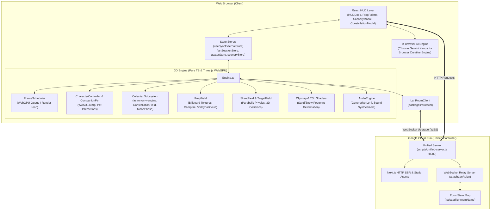

# 🏛️ System Architecture

Chill is built as a modern, browser-native 3D casual space using **Three.js WebGPU / TSL**, **Next.js 16**, **Web Audio API**, **In-Browser AI**, and a dedicated **Multi-Room WebSocket Protocol** deployed on **Google Cloud Run (Unified Server)**.

---

## 📦 1. Monorepo Structure

```
chill/
├── apps/
│   └── web/                         # Next.js 16 Web Application & WebGPU 3D Engine
│       ├── src/
│       │   ├── app/                 # Next.js App Router (Page views & Layouts)
│       │   ├── components/          # React UI & HUD Layer
│       │   │   ├── hud/             # HUDDock, PropPaletteModal, SceneryModal, ConstellationModal
│       │   │   └── world/           # Canvas Host, AutoJoin, Minimap
│       │   ├── engine/              # Pure TypeScript 3D WebGPU Engine (Framework-agnostic)
│       │   │   ├── camera/          # Orbit & 3rd-person Camera Rig with Damping
│       │   │   ├── character/       # Chibi Avatar Mesh, Kinematics, Jump, CompanionPet
│       │   │   ├── core/            # Engine, FrameScheduler, Clock, EventBus, QualityTier
│       │   │   ├── minigame/        # SkeetField (เป้าบิน), TargetField (เป้าล้ม)
│       │   │   ├── multiplayer/     # RemoteAvatar interpolation, LOD tiers
│       │   │   ├── props/           # PropField, VolleyballCourt, Dynamic 2D Canvas Textures
│       │   │   ├── render/          # WebGPU/WebGL2 Pipeline Builder, CSM Shadows
│       │   │   ├── sky/             # ConstellationField (IAU 88 stars), MoonPhase (astronomy-engine)
│       │   │   ├── terrain/         # Clipmap, HeightField, Sand/Snow Footprint Deformation
│       │   │   └── tsl/             # TSL Shaders (Sky Atmosphere, Water, Snow/Sand Terrain)
│       │   └── lib/                 # State stores, AI Engine & Procedural Audio
│       │       ├── ai/              # In-Browser AI (Chrome Prompt API + In-Browser Generative)
│       │       ├── audio/           # Generative Lo-fi Synth, Ambience Bed, Sound Effects
│       │       ├── avatar/          # Chibi Avatar Customization & Random Names
│       │       ├── lan/             # LAN Session Store & Multi-room Sync
│       │       └── scenery/         # 5 Scenery Registries & Archetype Presets
├── packages/
│   └── protocol/                    # Shared Wire Types, LanRoomClient, RoomClient Interface
├── scripts/
│   ├── lan-relay.ts                 # Multi-Room Isolated WebSocket Relay Server
│   ├── unified-server.ts            # Production Unified Server (Next.js + WebSocket on port 8080)
│   └── deploy-gcp.sh                # One-Click Cloud Run Deployment Script
├── Dockerfile                       # Multi-stage Containerfile for Unified Cloud Run Server
└── docs/                            # Project Documentation & User Manuals
```

---

## 🔄 2. Data Flow & Subsystems Architecture



---

## ⚙️ 3. Subsystem Breakdown

### 1. 3D Engine Core (`engine/core/`)
- **`Engine.ts`**: The central coordinator owning the scene graph, camera rig, avatar controllers, celestial sky dome, terrain clipmaps, interactive props, and mini-game states.
- **`FrameScheduler.ts`**: WebGPU frame queue orchestrator that handles asynchronous submit pipelines, requestAnimationFrame throttling, and graceful frame error recovery.
- **`QualityTier.ts`**: Dynamic adaptive performance scaling (`high`, `medium`, `low`) adjusting shadow map resolution, SSAO, bloom, and remote avatar detail tiers based on device FPS.

### 2. Celestial & Astronomy Engine (`engine/sky/`)
- **`ConstellationField.ts`**: Real-time celestial sphere rendering 5,044 Hipparcos catalog stars, 88 IAU constellation stick figures, and 85 Johan Meuris mythological illustrations projected using barycentric affine grid warping.
- **`MoonPhase.ts`**: Real-time lunar phase calculation using `astronomy-engine` for exact celestial phase angles, astronomical terminator curve geometry, and ethereal atmospheric glow.

### 3. Terrain & TSL Shaders (`engine/terrain/`, `engine/tsl/`)
- **GPU Clipmap**: Concentric nested terrain mesh rings centered around the player, reducing polygon overhead while preserving high near-camera geometric detail.
- **TSL Shaders**: Three.js Shading Language nodes for real-time atmosphere scattering, day/night transitions, procedural ocean water reflection, and ping-pong depth buffers for dynamic footprints on sand and snow.

### 4. Interactive Props & Dynamic Canvas Textures (`engine/props/`)
- **Dynamic HTML5 Canvas Textures**: 2560x1024 ultra-crisp resolution text rendering on 3D billboards and wooden signs, updated and synchronized across peers in real-time.
- **Interactive Props**: Campfire, lanterns, tea table, tent, radio, fireworks launcher, zen stones, and full volleyball court.

### 5. In-Browser AI Engine (`lib/ai/`)
- **100% In-Browser & Private**: Leverages Chrome Built-in AI (Prompt API / Gemini Nano on device) alongside client-side creative generation heuristics. Zero server LLM or external GPU dependencies required.

### 6. Multiplayer & Networking (`packages/protocol/`, `scripts/lan-relay.ts`, `scripts/unified-server.ts`)
- **Unified Single-Port Deployment**: Next.js HTTP server and WebSocket Relay server listen on the same port (`8080`), enabling seamless deployment to Google Cloud Run as a single container without CORS or dual-domain overhead.
- **Multi-Room Isolated Relay**: In-memory WebSocket hub that strictly routes snapshots, thoughts, props, billboards, and sports match states per `roomName`.
- **Anti-Ghost Eviction**: Connection deduplication that immediately kicks old tabs and broadcasts clean `leave` events upon page reload.
- **Remote Avatars (`RemoteAvatar.ts`)**: Dead-reckoning snapshot interpolation with remote gesture triggering and distance-based LOD tiers.
